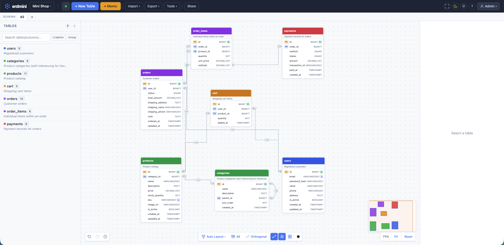

# erdmini

**A free, open-source ERD (Entity Relationship Diagram) editor.**
Runs in the browser with zero setup, or self-host with SQLite for team collaboration.

| Mode | Description |
|---|---|
| **Local** | Pure browser SPA — IndexedDB storage, no signup, no server needed. [Try it now](https://erdmini.dornol.dev) |
| **Server** | Self-hosted Node.js + SQLite — auth (local + OIDC + LDAP), real-time collaboration, MCP AI integration |

[Live Demo](https://erdmini.dornol.dev) | [Docker](https://github.com/dornol/erdmini/pkgs/container/erdmini)



[](https://youtu.be/1q-bGKXrrvM)

---

## Highlights

- **Two modes** — Browser-only (IndexedDB) or self-hosted server (SQLite + auth + real-time collab).
- **AI-powered** — Claude MCP integration with 72 tools for schema design via natural language.
- **Full DDL support** — Import/export SQL for MySQL, PostgreSQL, MariaDB, MSSQL, SQLite, Oracle, H2.
- **Multiple formats** — Prisma, DBML, Mermaid, PlantUML, JSON, PNG, SVG, PDF.
- **4 languages** — Korean, English, Japanese, Chinese.

---

## Features

### Canvas & Editing
- Zoom (5%–300%), pan (right-click drag / space+drag), rubber band selection
- Minimap, grid snap, align & distribute tools, fit to window
- Undo/Redo (200 steps) with visual history timeline
- 4 themes: Modern, Classic, Blueprint, Minimal
- Image export: PNG, SVG, PDF

### Tables & Columns
- Inline table name editing, color, group, comment, schema assignment
- Table templates (users, audit_log, settings, files, tags)
- Table duplication, position lock, cross-project copy/paste
- 16 column types with PK/FK/UQ/AI/CK badges
- Drag to reorder, double-click to edit in popup, quick-add button
- ENUM value lists, DECIMAL precision/scale, CHECK constraints

### Foreign Keys
- Crow's Foot Notation with bezier / straight / orthogonal line styles
- Dashed lines for nullable FKs, automatic 1:1 / 1:N detection
- FK popover (click to view/edit/delete), inline label editing
- ON DELETE / ON UPDATE referential actions

### Domains
- Reusable column property templates — changes propagate to all linked columns
- Hierarchy (parent/child with circular reference detection), grouping
- Coverage analysis dashboard, dictionary export (HTML/Markdown/XLSX)

### Schema Namespaces
- Assign tables to schemas (e.g., `public`, `auth`, `billing`)
- Per-schema canvas viewport, DDL export with `CREATE SCHEMA`

### Import / Export

| Direction | Formats |
|---|---|
| **Import** | DDL (7 dialects), Prisma, DBML |
| **Export** | DDL (7 dialects), Prisma, DBML, Mermaid, PlantUML, JSON, PNG, SVG, PDF |

### Schema Tools
- Validation / linting (9 rules)
- Version diff (color-coded comparison)
- Named snapshots with auto-snapshot (5 min interval)
- Migration SQL generation (ALTER TABLE from diffs)
- URL sharing (compressed schema in URL hash)
- Command palette (Ctrl+K): search tables and columns
- SQL Playground — in-browser SQL execution via sql.js (WASM)

### Sticky Memos
- Canvas sticky notes with 6 colors, resize, inline editing
- Table attachment — drag memo onto a table, moves together

### Auto Layout

| Type | Description |
|---|---|
| **Grid** | BFS-ordered, FK-linked tables adjacent |
| **Hierarchical** | Top-down FK hierarchy, barycenter optimization |
| **Radial** | d3-force simulation, FK-linked clustering |

---

## Server Mode

Self-host erdmini with SQLite for teams. Switch via `PUBLIC_STORAGE_MODE=server`.

| Feature | Details |
|---|---|
| **Auth** | Local (username/password) + OIDC + LDAP |
| **Groups** | User groups, per-project group permissions, OIDC/LDAP group auto-sync |
| **Permissions** | Per-project roles (owner/editor/viewer), per-user permission flags |
| **Collaboration** | Real-time WebSocket sync, cursor display, LWW conflict resolution |
| **MCP** | Streamable HTTP endpoint (`/mcp`), API key auth, 72 tools |
| **Admin** | User/group/provider management, site branding, API keys |
| **Audit** | Action logging with configurable retention |
| **Embed** | Read-only iframe embed with token + optional password |
| **Logging** | JSON Lines or text, configurable log level |

---

## Quick Start

### Browser (No Install)

Visit **[erdmini.dornol.dev](https://erdmini.dornol.dev)** — data stays in your browser (IndexedDB).

### Docker (Server Mode)

```bash
docker run -d \
  --name erdmini \
  -p 3000:3000 \
  -v erdmini-data:/data \
  ghcr.io/dornol/erdmini:latest-server
```

Check the auto-generated admin password:
```bash
docker logs erdmini | grep Password
```

### Docker (Local Mode)

```bash
docker run -d --name erdmini-local -p 8080:80 ghcr.io/dornol/erdmini:latest
```

See [DOCKER.md](DOCKER.md) for Docker Compose, reverse proxy, ARM64 builds, and more.

---

## Development

```bash
pnpm install
pnpm dev              # http://localhost:3000 (local mode)
pnpm dev:server       # server mode (SQLite + Auth)
pnpm build            # static SPA build
pnpm build:server     # server build (Node.js)
pnpm test             # vitest (73 files, 2329 tests)
pnpm check            # svelte-check
```

### Tech Stack

| Category | Technology |
|---|---|
| Framework | SvelteKit 2 + Svelte 5 (Runes) |
| Styling | Tailwind CSS v4 |
| Build | Vite 7, TypeScript, pnpm |
| i18n | Paraglide JS v2 |
| DB (server) | SQLite (better-sqlite3, WAL) |
| Real-time | WebSocket (ws) |
| MCP | Streamable HTTP |

---

## Environment Variables

| Variable | Default | Description |
|---|---|---|
| `PUBLIC_STORAGE_MODE` | `local` | `local` (SPA + IndexedDB) or `server` (Node.js + SQLite) |
| `DB_PATH` | `data/erdmini.db` | SQLite file path (server mode) |
| `PORT` | `3000` | HTTP port (server mode) |
| `ADMIN_USERNAME` | `admin` | Initial admin username |
| `ADMIN_PASSWORD` | auto-generated | Initial admin password (printed to logs) |
| `BASE_PATH` | — | Subdirectory deployment path (e.g., `/erdmini`) |
| `PUBLIC_SITE_URL` | — | Canonical URL for SEO |
| `PUBLIC_APP_URL` | `http://localhost:3000` | App URL for OIDC redirect URIs |
| `SESSION_MAX_AGE_DAYS` | `30` | Session cookie expiry |
| `LOG_FORMAT` | `text` | `json` or `text` |
| `LOG_LEVEL` | `info` | `debug` / `info` / `warn` / `error` |

---

## Security

- **XSS**: Svelte auto-escaping; `{@html}` only for JSON-LD with `</` escape
- **CSRF**: JSON-only APIs (SvelteKit origin check), `httpOnly` + `sameSite: lax` + `secure` cookies
- **WebSocket**: Origin validation + session auth
- **MCP**: Bearer token auth (immune to CSRF)
- **Headers**: CSP, `X-Content-Type-Options`, `X-Frame-Options`, `Referrer-Policy`

---

## License

MIT

---

> Built with [Claude Code](https://claude.ai/claude-code) (Anthropic CLI)
